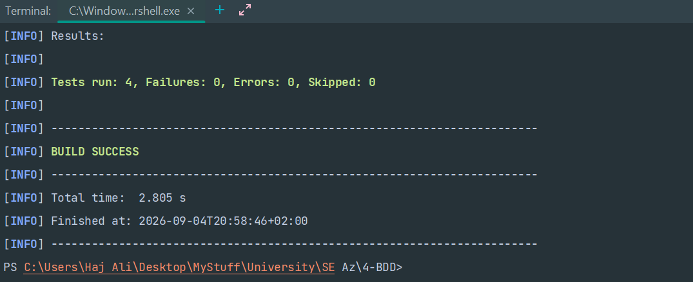
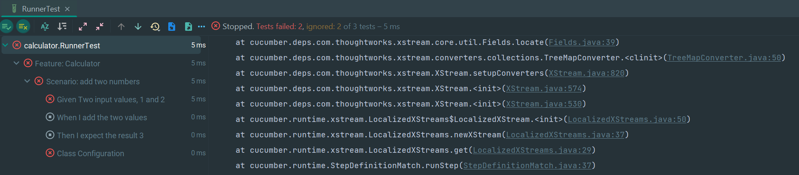
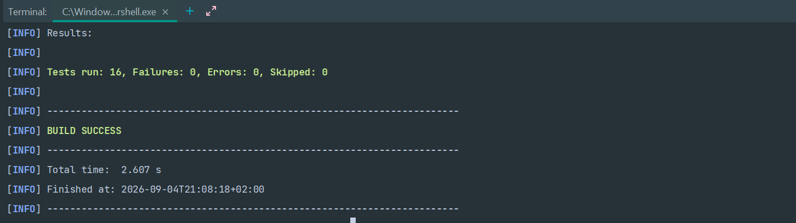
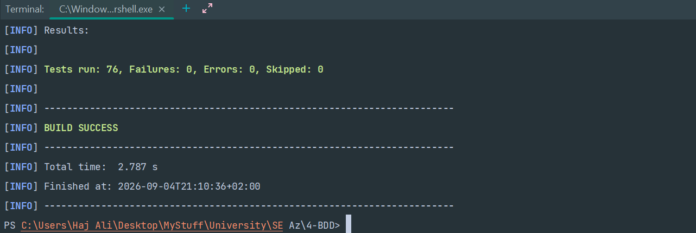

<h1 dir="rtl" align="right">گزارش آزمایش BDD — ماشین‌حساب</h1>

<p dir="rtl" align="right">
<b>نام و نام خانوادگی:</b> علی نجار<br>
<b>شماره دانشجویی:</b> 401102701<br>
</p>

<hr>

<h2 dir="rtl" align="right">1. هدف آزمایش</h2>

<p dir="rtl" align="right">
هدف این آزمایش آشنایی عملی با <b>Behavior-Driven Development (BDD)</b> و تبدیل نیازمندی‌های متنی به سناریوهای قابل اجرا بود.
در این روش، رفتار مورد انتظار سیستم ابتدا با زبان قابل فهم Gherkin و ساختار
<code>Given / When / Then</code> توصیف شده و سپس این مراحل به کد Java متصل می‌شوند.
</p>

<p dir="rtl" align="right">
آزمایش در دو بخش اصلی انجام شد:
</p>

<ol dir="rtl">
  <li>بازسازی مثال جمع دو عدد موجود در دستورکار و بررسی <code>Scenario Outline</code>.</li>
  <li>پیاده‌سازی ماشین‌حساب برای عملیات ضرب (<code>*</code>)، تقسیم (<code>/</code>) و توان (<code>^</code>) و نوشتن تست‌های BDD برای آن.</li>
</ol>

<p dir="rtl" align="right">
در بخش اول علاوه بر اجرای سناریوی معمولی، یک مشکل <code>undefined</code> در ورودی منفی بررسی و رفع شد.
در بخش دوم نیز سناریوهای معمولی و Outline برای عملیات خواسته‌شده نوشته شدند و در نهایت تمام تست‌ها با Maven با موفقیت اجرا شدند.
</p>

<hr>

<h2 dir="rtl" align="right">2. ساختار پروژه</h2>

<p dir="rtl" align="right">
ساختار کلی پروژه به صورت زیر است:
</p>

```text
.
├── assets/
│   ├── 1.png
│   ├── 2.png
│   ├── 3.png
│   └── 4.png
├── pom.xml
├── README.md
└── src/
    ├── main/
    │   └── java/
    │       └── calculator/
    │           └── Calculator.java
    └── test/
        ├── java/
        │   └── calculator/
        │       ├── MyStepdefs.java
        │       └── RunnerTest.java
        └── resources/
            └── features/
                ├── addition.feature
                └── calculator.feature
```

<p dir="rtl" align="right">
کد اصلی برنامه در <code>src/main/java</code> قرار دارد و سناریوهای BDD و کدهای مربوط به تست در <code>src/test</code> نگهداری می‌شوند.
</p>

<hr>

<h2 dir="rtl" align="right">3. بخش اول — پیاده‌سازی مثال جمع دو عدد</h2>

<p dir="rtl" align="right">
در قدم اول، سناریوی ساده جمع دو عدد مطابق مثال دستورکار نوشته شد:
</p>

```gherkin
Feature: Calculator

  Scenario: add two numbers
    Given Two input values, 1 and 2
    When I add the two values
    Then I expect the result 3
```

<p dir="rtl" align="right">
کلاس اصلی در ابتدا فقط متد جمع را داشت:
</p>

```java
package calculator;

public class Calculator {

    public int add(int a, int b) {
        return a + b;
    }
}
```

<p dir="rtl" align="right">
برای اتصال عبارت‌های Gherkin به Java، Step Definitionهای مربوط به Given، When و Then نوشته شدند.
در این مرحله اجرای اولیه تست با Maven موفق بود.
</p>

<p align="center">
  
</p>

<hr>

<h2 dir="rtl" align="right">4. Scenario Outline و مشکل undefined</h2>

<p dir="rtl" align="right">
بعد از موفقیت سناریوی ساده، Scenario Outline زیر به feature مربوط به جمع اضافه شد:
</p>

```gherkin
Scenario Outline: add two numbers
  Given Two input values, <first> and <second>
  When I add the two values
  Then I expect the result <result>

  Examples:
    | first | second | result |
    | 1     | 12     | 13     |
    | -1    | 6      | 5      |
    | 2     | 2      | 4      |
```

<h3 dir="rtl" align="right">5.1. علت بروز undefined</h3>

<p dir="rtl" align="right">
Step Definition اولیه برای دریافت ورودی‌ها به صورت زیر بود:
</p>

```java
@Given("^Two input values, (\\d+) and (\\d+)$")
public void twoInputValuesAnd(int arg0, int arg1) {
    value1 = arg0;
    value2 = arg1;
}
```

<p dir="rtl" align="right">
عبارت منظم <code>\d+</code> تنها یک یا چند رقم را match می‌کند و علامت منفی را نمی‌پذیرد.
بنابراین در Example مربوط به <code>-1</code>، عبارت
<code>Given Two input values, -1 and 6</code>
با Step Definition بالا تطبیق پیدا نمی‌کرد و Cucumber آن را به صورت <code>undefined</code> گزارش می‌کرد.
</p>

<p align="center">
  
</p>

<h3 dir="rtl" align="right">5.2. رفع مشکل</h3>

<p dir="rtl" align="right">
برای پشتیبانی از عدد منفی، علامت منفی به صورت اختیاری به regex اضافه شد:
</p>

```java
@Given("^Two input values, (-?\\d+) and (-?\\d+)$")
public void twoInputValuesAnd(int arg0, int arg1) {
    value1 = arg0;
    value2 = arg1;
}
```

<p dir="rtl" align="right">
در عبارت <code>-?</code>، کاراکتر <code>?</code> به این معناست که علامت منفی می‌تواند صفر یا یک بار وجود داشته باشد.
در نتیجه هم اعداد مثبت و هم اعداد منفی توسط همان Step Definition پذیرفته می‌شوند.
</p>

<p dir="rtl" align="right">
بعد از این اصلاح، اجرای Scenario و Scenario Outline مربوط به مثال جمع بدون خطا انجام شد:
</p>

<p align="center">
  
</p>

<p dir="rtl" align="right">
در این مرحله Maven تعداد 16 تست ثبت‌شده توسط Surefire را با
<code>Failures: 0</code>،
<code>Errors: 0</code> و
<code>Skipped: 0</code>
گزارش کرد.
</p>

<hr>

<h2 dir="rtl" align="right">6. بخش دوم — ماشین‌حساب ضرب، تقسیم و توان</h2>

<p dir="rtl" align="right">
در بخش اصلی مسئله، ماشین‌حساب باید دو عدد صحیح و یک عملگر دریافت کرده و یکی از عملیات زیر را انجام دهد:
</p>

<ul dir="rtl">
  <li><code>*</code> برای ضرب</li>
  <li><code>/</code> برای تقسیم</li>
  <li><code>^</code> برای توان</li>
</ul>

<p dir="rtl" align="right">
نمونه‌های اصلی خواسته‌شده در صورت مسئله:
</p>

<div dir="rtl">

| ورودی اول | ورودی دوم | عملگر | نتیجه |
|---:|---:|:---:|---:|
| 6 | 2 | `*` | 12 |
| 6 | 2 | `/` | 3 |
| 6 | 2 | `^` | 36 |

</div>

<h3 dir="rtl" align="right">6.1. سناریوهای معمولی</h3>

```gherkin
Scenario: multiply two integers
  Given Two input values, 6 and 2
  When I press the * key
  Then I expect the result 12

Scenario: divide two integers
  Given Two input values, 6 and 2
  When I press the / key
  Then I expect the result 3

Scenario: raise a number to a power
  Given Two input values, 6 and 2
  When I press the ^ key
  Then I expect the result 36
```

<h3 dir="rtl" align="right">6.2. Scenario Outline</h3>

<p dir="rtl" align="right">
برای جلوگیری از تکرار یک سناریوی یکسان با داده‌های مختلف، از Scenario Outline استفاده شد.
در این حالت بدنه سناریو یک بار نوشته می‌شود و داده‌ها از جدول Examples تأمین می‌شوند.
</p>

```gherkin
Scenario Outline: calculate two integer inputs
  Given Two input values, <first> and <second>
  When I press the <opt> key
  Then I expect the result <result>

  Examples:
    | first | second | opt | result |
    | 6     | 2      | *   | 12     |
    | 6     | 2      | /   | 3      |
    | 6     | 2      | ^   | 36     |
```

<p dir="rtl" align="right">
علاوه بر نمونه‌های اصلی، برای پوشش بهتر رفتار سیستم می‌توان/در پروژه از حالت‌هایی مانند اعداد منفی، صفر،
تقسیم با نتیجه اعشاری، توان صفر و تقسیم بر صفر نیز استفاده کرد.
</p>

<hr>

<h2 dir="rtl" align="right">7. پیاده‌سازی Calculator</h2>

<p dir="rtl" align="right">
کلاس Calculator منطق اصلی برنامه را نگهداری می‌کند. عملیات ضرب و تقسیم به صورت مستقیم پیاده‌سازی شده‌اند.
در تقسیم، تبدیل به <code>double</code> باعث می‌شود نتیجه‌هایی مانند <code>7 / 2 = 3.5</code> از بین نروند.
</p>

```java
public double multiply(int a, int b) {
    return (double) a * b;
}

public double divide(int a, int b) {
    if (b == 0) {
        throw new ArithmeticException("Division by zero is not allowed");
    }

    return (double) a / b;
}
```

<h3 dir="rtl" align="right">7.1. پیاده‌سازی توان با ضرب تکراری</h3>

<p dir="rtl" align="right">
طبق صورت مسئله، برای محاسبه توان از <code>Math.pow</code> استفاده نشد و توان با ضرب تکراری پیاده‌سازی شد.
برای مثال، محاسبه <code>6^3</code> به صورت
<code>1 × 6 × 6 × 6</code>
انجام می‌شود.
</p>

```java
public double power(int base, int exponent) {
    if (base == 0 && exponent < 0) {
        throw new ArithmeticException(
                "Zero cannot be raised to a negative power"
        );
    }

    if (exponent == 0) {
        return 1.0;
    }

    long exp = exponent;
    boolean negativeExponent = exp < 0;

    if (negativeExponent) {
        exp = -exp;
    }

    double result = 1.0;

    for (long i = 0; i < exp; i++) {
        result *= base;
    }

    return negativeExponent ? 1.0 / result : result;
}
```

<p dir="rtl" align="right">
متد مرکزی Calculator نیز با توجه به عملگر، عملیات مناسب را انتخاب می‌کند:
</p>

```java
public double calculate(int first, int second, char operator) {
    switch (operator) {
        case '*':
            return multiply(first, second);
        case '/':
            return divide(first, second);
        case '^':
            return power(first, second);
        default:
            throw new IllegalArgumentException(
                    "Unsupported operator: " + operator
            );
    }
}
```

<hr>

<h2 dir="rtl" align="right">8. Step Definitions</h2>

<p dir="rtl" align="right">
Step Definitionها واسط بین جملات Gherkin و کد Java هستند.
به بیان ساده، Cucumber متن هر Step را می‌خواند و با استفاده از regex، متد Java متناظر را پیدا می‌کند.
</p>

<p dir="rtl" align="right">
نمونه Step دریافت ورودی:
</p>

```java
@Given("^Two input values, (-?\\d+) and (-?\\d+)$")
public void twoInputValuesAnd(int arg0, int arg1) {
    value1 = arg0;
    value2 = arg1;
}
```

<p dir="rtl" align="right">
نمونه Step انتخاب عملگر:
</p>

```java
@When("^I press the ([*/^]) key$")
public void iPressTheOperatorKey(String operator) {
    result = calculator.calculate(
            value1,
            value2,
            operator.charAt(0)
    );
}
```

<p dir="rtl" align="right">
نمونه بررسی نتیجه:
</p>

```java
@Then("^I expect the result (-?\\d+(?:\\.\\d+)?)$")
public void iExpectTheResult(double expected) {
    Assert.assertEquals(expected, result, 1e-9);
}
```

<p dir="rtl" align="right">
در regex بالا بخش اعشاری اختیاری است؛ بنابراین نتیجه‌هایی مانند
<code>12</code>،
<code>-8</code>،
<code>3.5</code> و
<code>0.25</code>
قابل بررسی هستند.
</p>

<hr>

<h2 dir="rtl" align="right">9. Hook از نوع Before</h2>

<p dir="rtl" align="right">
از Annotation مربوط به <code>@Before</code> استفاده شد تا قبل از اجرای هر Scenario، یک Calculator جدید ساخته شود.
این کار باعث می‌شود Scenarioها مستقل از یکدیگر باشند و state باقی‌مانده از تست قبلی روی تست بعدی اثر نگذارد.
</p>

```java
@Before
public void before() {
    calculator = new Calculator();
}
```

<hr>

<h2 dir="rtl" align="right">10. Runner و اجرای تست‌ها</h2>

<p dir="rtl" align="right">
برای اجرای featureها از Cucumber Runner مبتنی بر JUnit استفاده شد:
</p>

```java
@RunWith(Cucumber.class)
@CucumberOptions(
        features = "src/test/resources/features",
        glue = "calculator",
        monochrome = true
)
public class RunnerTest {
}
```

<p dir="rtl" align="right">
گزینه <code>features</code> مسیر فایل‌های Gherkin و گزینه <code>glue</code> package مربوط به Step Definitionها را تعیین می‌کند.
</p>

<p dir="rtl" align="right">
دستور نهایی اجرای تست‌ها:
</p>

```bash
mvn clean test
```

<p dir="rtl" align="right">
خروجی نهایی پروژه نشان می‌دهد Maven/Surefire تعداد 76 تست را بدون Failure، Error یا Skip اجرا کرده است:
</p>

<p align="center">
  
</p>

<p dir="rtl" align="right">
خلاصه خروجی نهایی:
</p>

```text
Tests run: 76
Failures: 0
Errors: 0
Skipped: 0

BUILD SUCCESS
```

<hr>


<hr>

<h2 dir="rtl" align="right">17. استفاده از ابزارهای هوش مصنوعی</h2>

<p dir="rtl" align="right">
در انجام این آزمایش از ابزار هوش مصنوعی <b>ChatGPT</b> به عنوان دستیار کمکی در فرایند توسعه و مستندسازی استفاده شد.
هدف از استفاده از هوش مصنوعی، دریافت توضیح درباره مفاهیم، بررسی خطاها، پیشنهاد راه‌حل و کمک به ساختاردهی گزارش بود و
نتایج نهایی به صورت عملی در محیط توسعه بررسی و آزمایش شدند.
</p>

<p dir="rtl" align="right">
موارد اصلی استفاده از هوش مصنوعی در این پروژه شامل موارد زیر بود:
</p>

<ul dir="rtl">
  <li>
    توضیح مفاهیم BDD، Gherkin، Scenario، Scenario Outline، Step Definition و نقش
    Given / When / Then.
  </li>

  <li>
    کمک به تحلیل مشکل <code>undefined</code> در Scenario Outline و بررسی عبارت منظم
    مربوط به اعداد منفی.
  </li>

  <li>
    پیشنهاد ساختار مناسب برای فایل‌های پروژه و نحوه سازمان‌دهی
    <code>main</code>،
    <code>test</code>،
    <code>features</code>
    و Step Definitionها.
  </li>

  <li>
    بررسی و پیشنهاد موارد تست برای عملیات ضرب، تقسیم و توان، از جمله برخی حالت‌های مرزی.
  </li>

  <li>
    کمک به تهیه و ساختاردهی فایل README و گزارش نهایی آزمایش.
  </li>

  <li>
    پیشنهاد شیوه استفاده از Git، GitHub Issues و GitHub Projects/Kanban برای مدیریت مراحل انجام پروژه.
  </li>
</ul>

<p dir="rtl" align="right">
فایل چت در AI_AGENT.md قرار دارد.
</p>
